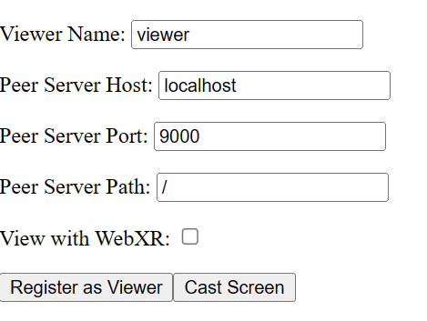
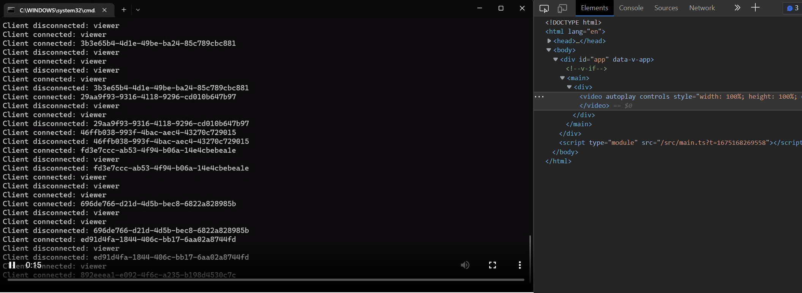
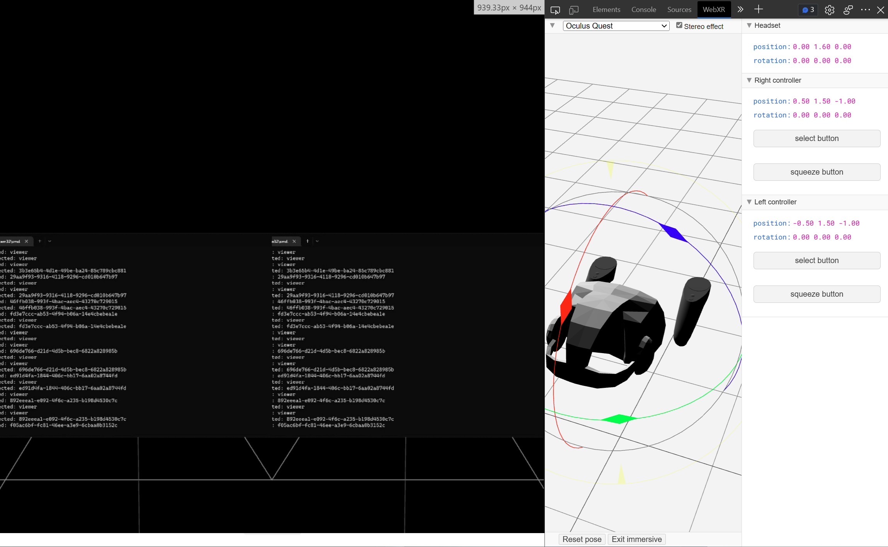

# WebCaster

A simplest but powerful demo using peerjs(for WebRTC) and threejs(for WebXR).

Cast your PC screen to any browser, with WebXR support!

## Features

Configuration:



View as a video:



View with WebXR:



## Getting Started

```bash
# clone this repo
git clone https://github.com/DiscreteTom/WebCaster.git

# add dependencies
yarn

# build static files
yarn build

# host http server
yarn start

# start peer server
npx peerjs --port 9000 --path /
```

Then, on one device, click 'Register as Viewer', on another device, click 'Cast Screen', you will see your screen on the viewer device.

## Credit

The WebXR part of this project is highly inspired by [threejs-webrtc](https://github.com/AidanNelson/threejs-webrtc).
